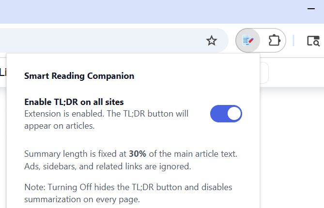

# Smart Reading Companion

Smart Reading Companion is a Chrome Extension that summarizes long-form web articles into clean, structured paragraphs. It extracts the main content (ignoring ads, sidebars, and related links) and produces a concise summary—targeting about **30%** of the article length—so you can understand the key ideas quickly.

---

## Features

- **Toggle TL;DR globally** from the extension popup.
- **Floating TL;DR button** on article pages for on-demand summaries.
- **Main-content extraction** using `Readability.js`; ads/sidebars are skipped.
- **Paragraph-structured summaries** that cover distinct topics/sections.
- **Backend API** powered by FastAPI and a summarization model (`bart-large-cnn`).
- **Configurable backend mode** via `.env` (local model vs. hosted API).

---

## Screenshots


*Extension popup with global TL;DR toggle.*

 
*Floating TL;DR button on supported pages.*


*In-progress summarization.*


*Clean, paragraph-based summary modal.*

---

## Tech Stack

**Extension (Frontend)**
- Manifest V3 Chrome Extension
- Vanilla JS, minimal CSS
- Mozilla Readability for article extraction

**Backend (API)**
- FastAPI
- Hugging Face Transformers (`bart-large-cnn`) or remote API
- `uvicorn` dev server

---

## Repository Structure

```plaintext
smart-reading-companion/
├── backend/
│   ├── main.py
│   ├── requirements.txt
│   └── .env                  # created by you; see sample below
├── libs/
│   └── Readability.js
├── content.js
├── popup.html
├── popup.js
├── style.css
├── manifest.json
└── images/
    ├── deee3228-1ef2-4989-88f0-d284bc56f9f1.png
    ├── 89b5de23-8085-4a70-9ae6-722857059023.png
    ├── 567f58cf-197e-41b4-a6be-4da80e94b017.png
    └── a20d095f-1eb3-4368-ac3a-7962930a1779.png

```

---

## Getting Started

**1) Clone the repository**

```plaintext
git clone https://github.com/AnkitHProfile/smart-reading-companion.git
cd smart-reading-companion
```

**2) Load the Extension in Chrome**

1. Open chrome://extensions/
2. Toggle Developer mode ON (top right)
3. Click Load unpacked
4. Select the project root folder (containing manifest.json)

**3) Start the Backend Server**
```plaintext
# (Optional) Create and activate virtual environment
python -m venv .venv
.\.venv\Scripts\activate    # Windows
source .venv/bin/activate   # Mac/Linux


# Install dependencies

pip install -r requirements.txt


# Start FastAPI server
uvicorn main:app --host 127.0.0.1 --port 8000 --reload
```

## Configuration
Create a `.env` file inside the `backend/` directory:

# Backend mode: local / remote
SUMMARIZER_BACKEND=local

```plaintext
# Hugging Face token (only if remote)
HF_TOKEN=your_hf_token_here

# Models
HF_MODEL=facebook/bart-large-cnn
LOCAL_MODEL=sshleifer/distilbart-cnn-12-6

# Performance & limits
REQUEST_TIMEOUT=60
MAX_WORKERS=4
MAX_INPUT_CHARS=60000
```

## Example popup.html
```plaintext
<!DOCTYPE html>
<html>
<head>
    <link rel="stylesheet" href="style.css">
</head>
<body>
    <h3>Smart Reading Companion</h3>
    <label class="switch">
        <input type="checkbox" id="toggle-tldr">
        <span class="slider round"></span>
    </label>
</body>
</html>
```

## Example style.css Toggle Fix
```plaintext
.slider.round:before {
    position: absolute;
    content: "";
    height: 18px; /* adjusted to fit perfectly */
    width: 18px;
    left: 2px;
    top: 2px; /* moved slightly up for perfect alignment */
    background-color: white;
    border-radius: 50%;
    transition: .4s;
}
```

---

## Development Notes

• Content Extraction: Readability.js isolates the article’s main content. The extension strips common non-article blocks before summarization.

• Summary Length: Targeted at ~30% of original text; actual varies with model output.

• UI: The header spacing prevents overlap with close button; toggle is pixel-aligned.

---

## Troubleshooting

Floating button still shows when disabled:
```plaintext
    - Ensure the popup toggle is OFF.
    - Content script listens to storage changes and removes the button when disabled.
    - Reload the page if needed.
```

## Windows can't delete .venv:
```plaintext
taskkill /F /IM python.exe
taskkill /F /IM uvicorn.exe
rmdir /s /q .venv
```

## API not reachable:
```plaintext
    - Ensure uvicorn is running at http://127.0.0.1:8000
    - Verify content.js endpoint matches backend
```
---

## Roadmap / Future Improvements

• Adjustable summary length in settings
• Multi-language summarization
• Offline summarization with local models

---
## License

MIT License
See LICENSE file for details.

---
